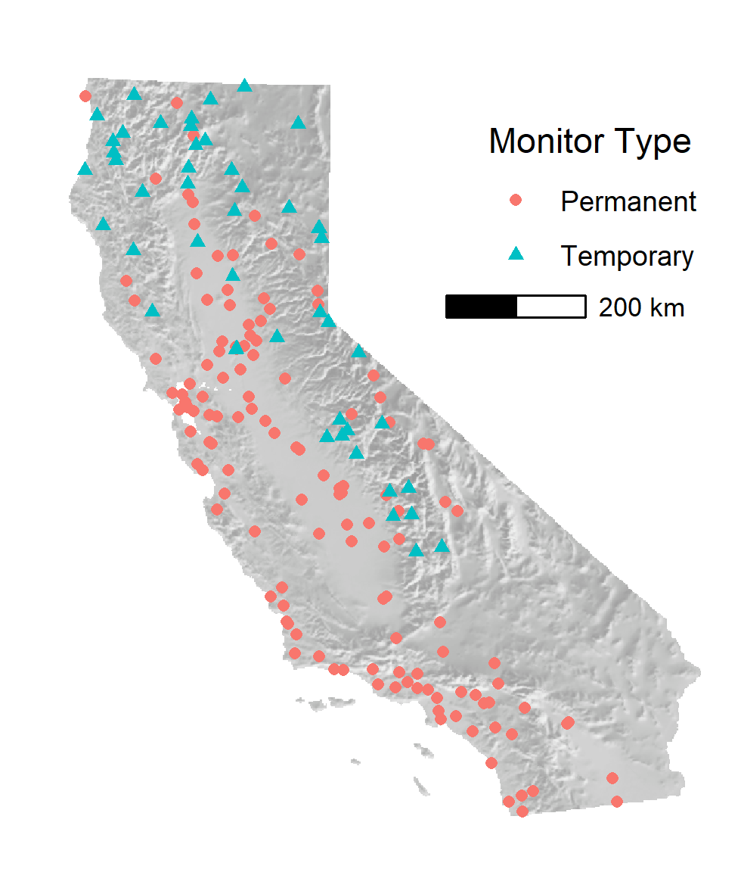
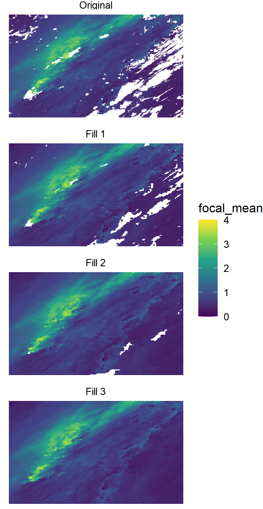
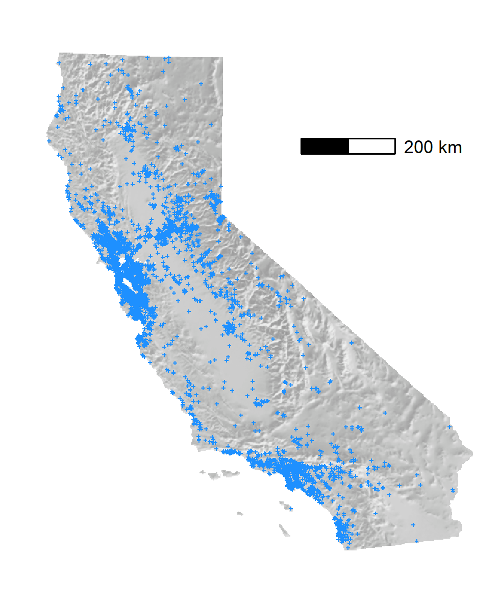
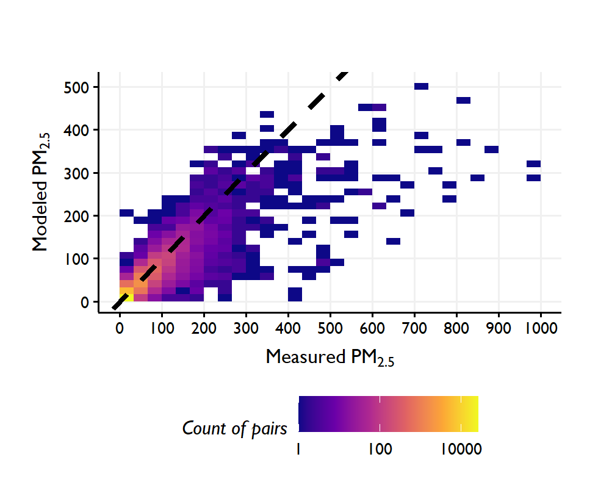
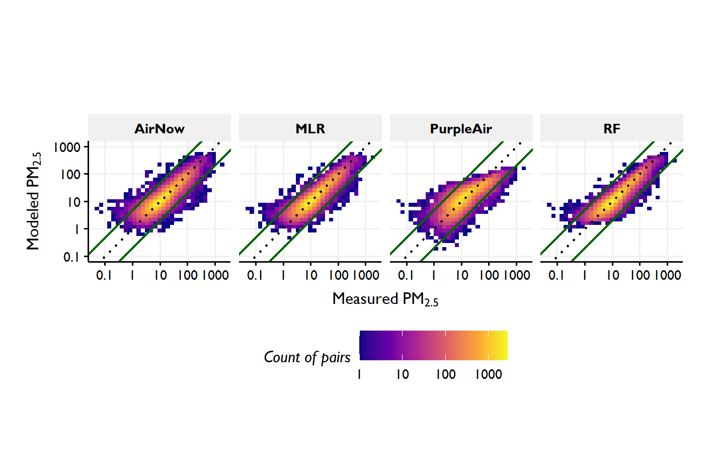
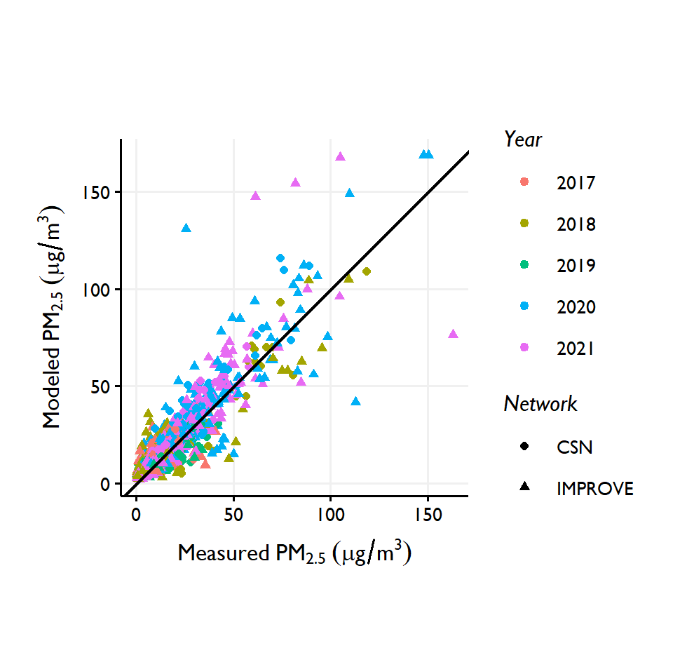
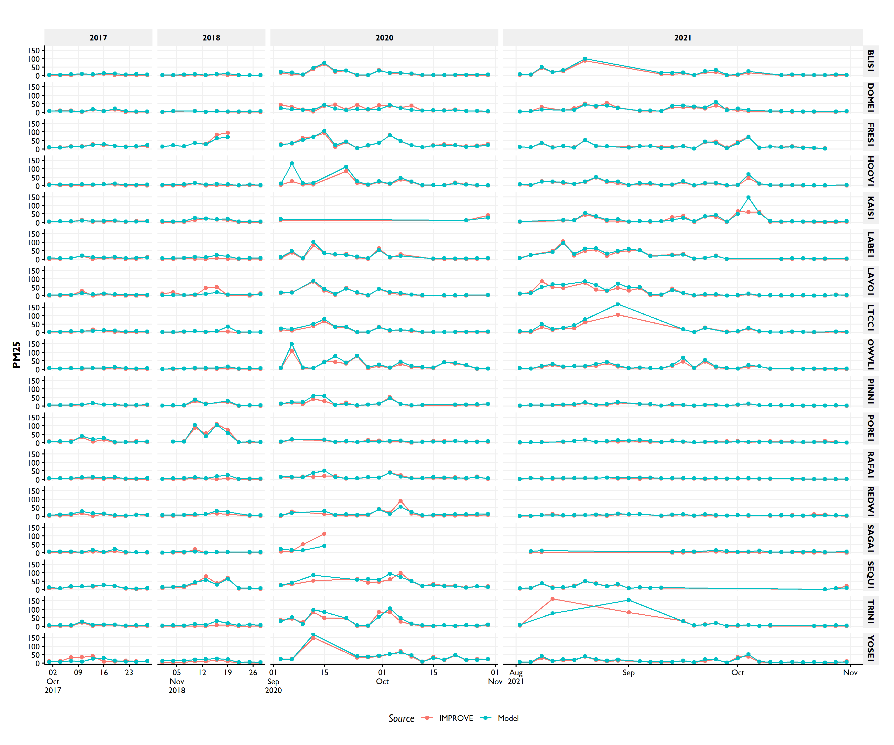
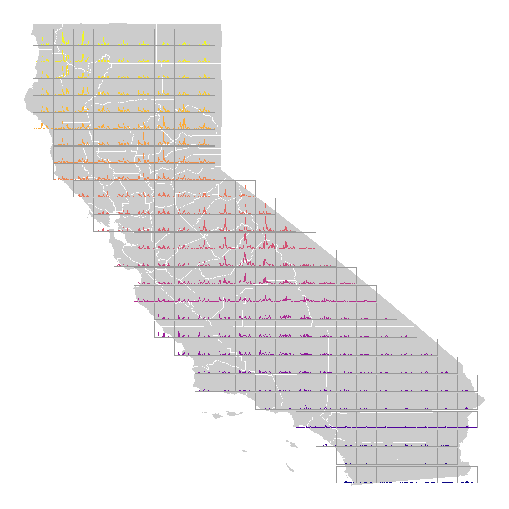
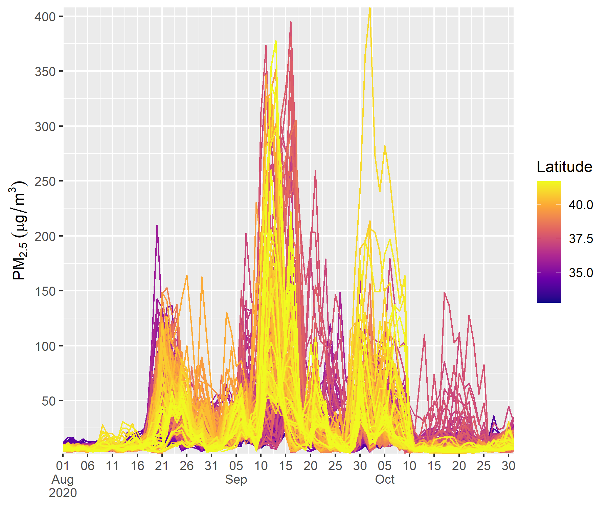
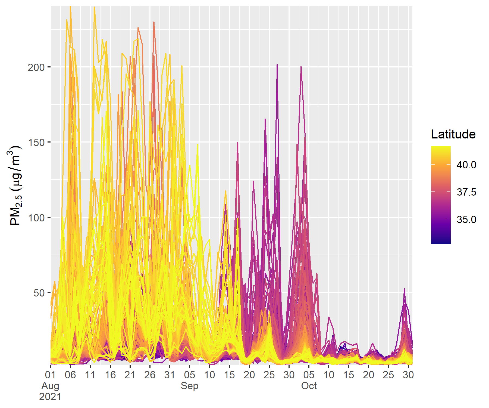

\introduction[Introduction]

-   California smoke impact on the rise (and throughout the west)
-   Expected to continue
-   Health impact of wildfire smoke and need for research
-   Need for rapid, inexpensive exposure modeling (increasing frequency and intensity of events)
-   pedigree (NASA HAQAST and Yufei's work)
-   growth of low-cost sensor networks and their fidelity for fires
-   Compared with other methods (land use regression), this may be more suitable for fires because of the regional nature of the source

# Methods

## Input Data Sets

### Official and Temporary Monitoring

Hourly PM~2.5~ observations are available from monitoring stations across the United States via the AirNow network [ref]. Within California, about [number] of monitors were operating during the study period. These permanent monitors are a mixture of federal reference method or federal equivalent method instruments, meaning that they are approved by the US EPA to calculate and report air quality to the public.\
During wildfires, temporary monitors are also deployed by several government agencies, such as the California Air Resources Board (CARB), and the USDA Forest Service (USFS). These are mostly [what]. Though they are not as accurate as the AirNow monitors [ref], they are deployed in regions where smoke impacts are significant and permanent monitoring is sparse or absent. The locations of permanent and temporary monitors as of September 1, 2021 is shown in Figure \ref{fig:monitors}. The permanent monitors are concentrated in the coastal and valley regions, while temporary monitors are focused in areas of complex terrain where most wildfires are located.

<!-- plot created in ./scripts/gmd_method_figures.R -->

```{r monitors, out.width = "8.3cm", echo = FALSE, fig.cap = "Map of permanent and temporary California monitor locations as of September 1, 2021.", fig.pos = "h"}

```

Hourly PM~2.5~ concentrations from both the permanent and temporary monitors were acquired using the `rapidfire::get_airnow_daterange` and `rapidfire::get_airsis_daterange` functions. These wrap the `monitor_subset` function from the `PWFSLSmoke` R package [Mazama Science]. `rapidfire::recast_monitors` was then used to calculate daily 24-hr averages from the hourly data. At least 16 hours are required to produce an average.\
The daily average data from both the permanent and temporary monitors were combined into a single data set. The spatial extent of the monitors used in this analysis are shown in Figure [xx]. Portions of this monitor data set were withheld for development and validation of the model. PM~2.5~ observations were log-transformed and interpolated to estimate concentrations at locations away from the monitors using ordinary kriging. 30% of the monitoring data were withheld as test data to develop model variograms using `rapidfire::create_airnow_variograms`.

### Smoke Modeling

Air quality models provide ground-level estimates of PM~2.5~ on an output grid. We processed daily average values acquired from the BlueSky Daily Run Viewer (Websky), developed by the USFS AirFire Team. Depending on the event year, different model runs were available. Modeling from Websky was chosen because it is available operationally, is high spatial resolution, and is focused specifically on modeling smoke aerosols from wildland fires; however, other air quality modeling could be substituted. [Susan, can you help me here to describe which models were used and their references?] On some days, the model did not run successfully. For those days, data were backfilled by using the second our third day of a previous day's 72-hr model run.

### Satellite Aerosol Optical Depth

Satellite aerosol optical depth (AOD) is a measure of the total columnar aerosol light extinction from the satellite sensor to the ground. AOD is indirectly related to PM~2.5~, with the relationship depending on aerosol type, humidity, and aerosol vertical profile [ref]. We used AOD from the Multi-Angle Implementation of Atmospheric Correction (MAIAC) project [ref]. MAIAC is an algorithm that uses time series analysis and additional processing to improve aerosol retrievals, atmospheric correction, and, importantly, cloud detection from the MODerate-resolution Imaging Spectroradiometers (MODIS) onboard NASA's Terra and Aqua satellites [Lyapustin et al, 2011a,b; 2021; 2018]. Past work has shown that thick smoke is often mistaken for clouds in the standard MODIS algorithms [ref], which hampers their use in wildfire conditions.\
The `rapidfire::maiac_download` function can be used to acquire the 1-km daily atmosphere product (MCD19A2) which contains AOD. Clouds prevent the retrieval of AOD, and there are sometimes clouds present even in the hot, dry conditions during California wildfires. The data fusion algorithm requires a complete data set, so a placeholder value must be used to gap-fill in locations under clouds. Previous work has used model-simuluated AOD, along with meteorological variables in a data fusion approach to gap-fill satellite-observed AOD [Zou 2019]. For this work, where clouds cover less of the domain, we took a simpler approach. Missing AOD values were filled using a three-stage focal average, available in `rapidfire::maiac_fill_gaps_complete`, and illustrated in Figure \ref{fig:gapfill}. In the first stage, a focal mean of a 5-by-5 pixel square (5 km) is used. In the second state, the window is increased to 9-by-9 and to 25-by-25 in the final stage. Any values that are still missing after the final stage are filled with the median value for the entire scene.

<!-- plot created in ./scripts/gmd_method_figures.R -->

```{r gapfill, out.width = "8.3cm", echo = FALSE, fig.cap = "Illustration of MAIAC AOD gap filling", fig.pos = "h"}

```

### Low-cost Sensors

There has been a proliferation of low-cost sensors that estimate PM~2.5~ deployed by the public across the world in the last decade. We used data from the PurpleAir network, which has grown to over 6500 outdoor sensors in California as of 2021. Figure \ref{fig:sensors} shows the locations of PurpleAir sensors reporting data on September 1, 2021. Coverage in populated areas is extensive.\
<!-- plot created in ./scripts/gmd_method_figures.R -->

```{r sensors, out.width = "8.3cm", echo = FALSE, fig.cap = "Map of California PurpleAir outdoor sensor locations as of September 1, 2021.", fig.pos = "h"}

```

While PurpleAir estimates of PM~2.5~ concentration have been shown to be biased, and are dependent on humidity and aerosol type [ref], they still strongly correlate with PM~2.5~ observed at FEM monitors and provide invaluable spatial and temporal information that is not available with the relatively sparse network of monitors. Because these sensors are not quality controlled or validated, and their sighting may be suspect, care must be taken when using them in modeling.\
rapidfire takes advantage of the AirSensor R package [Mazama Science] for discovering and acquiring PurpleAir sensor data from sensors designated as "outdoor." `rapidfire::create_purpleair_archive` was used to download and preprocess PurpleAir data from two-channel, 1-minute estimates to single 24-hr average values. The two channels were compared and data were only kept if both values were low ($<2\,\unit{\mu g\,m^{-3}}$) or were within a scaled relative difference ($SRD$) between channels $A$ and $B$ of 0.5. A daily mean was calculated for both channels and those were then averaged to produce a final daily estimate for the sensor.

```{=tex}
\begin{equation}
SRD=\frac{A-B}{\sqrt{2}}/\frac{A+B}{2}.  
\end{equation}
```
In addition to the channel comparison, we also employed a spatial test to remove sensors that were significantly different from their neighbors. rapidfire::purpleair_clean_spatial_outliers removes any sensors that are more that two standard deviations away from the median of all sites within $10\unit {km}$. PurpleAir estimates used in data fusion were log-transformed and then interpolated using ordinary kriging.

### Meteorology

Meteorological conditions can help explain the relationships between our inputs and observed PM~2.5~. For example, the PurpleAir sensor is sensitive to relative humidity. AOD is sensitive to humidty and planetary boundary layer height. Following Zou et al. (2019), we included several meteorological variables in our model, including temperature, winds, humidity, boundary layer height, and rainfall. These variables were acquired from the North American Regional Reanalysis (NARR) data set [ref].

## Data Fusion

We developed event specific models using random forests regression (RF). RF is a technique that uses a large number of randomly generated regression trees [@Breiman2001]. Each tree is constructed using a random subset of the training data and each node uses a random subset of the potential predictive variables. New values are estimated as the mean prediction of the individual trees. For each RF run, 500 trees were grown. A single tuning parameter, the number of variables selected at each node, was varied between 2 and 5. The model was trained using 10-fold cross-validation. Internally, `rapidfire::develop_model` uses the randomForest R package.\
For the final model, 10 predictor variables were used (Table \ref{table:1}). PM~2.5~ from the monitors was used as both a predictor and a target variable. A random subset of 30% of the monitoring data was withheld for model validation.

```{=tex}
\begin{table}[h]
\caption{Predictor variables used in the rapidfire RF model.}
\begin{tabular}{ll}
Variable       & Description                                                                    \\ \hline
PM25\_log\_ANK & Log-transformed, interpolated $PM_{2.5}$ from permanent and temporary monitors \\
PM25\_log\_PAK & Log-transformed, interpolated $PM_{2.5}$ estimates from PurpleAir sensors      \\
PM25\_bluesky  & Daily average ground-level $PM_{2.5}$ predictions from BlueSky smoke model     \\
MAIAC\_AOD     & Gap-filled  daily AOD from MAIAC                                               \\
air.2m         & Daily average ambient temperature at $2\unit{m}$ above ground level from NARR  \\
uwnd.10m       & Daily average u component of wind at $10\unit{m}$ above ground level from NARR \\
vwnd.10m       & Daily average v component of wind at $10\unit{m}$ above ground level from NARR \\
rhum.2m        & Daily average relative humidity at $2\unit{m}$ above ground level from NARR    \\
apcp           & Daily total precipitation amount from NARR                                     \\
hpbl           & Daily average height of the planetary boundary layer from NARR                
\end{tabular}
\label{table:1}
\end{table}
```
## Model Validation

We developed models for five large wildfire smoke events from 2017-2021 in Northern California (Table \ref{table:2}) and validated the modeling against two data sets of PM~2.5~ observations, 1) the permanent and temporary hourly monitors described above, and 2) 24-hr filter-based measurements from the IMPROVE and CSN networks.

```{=tex}
\begin{table}[h]
\caption{Modeled time periods and major Northern California wildfires}
\begin{tabular}{lll}
Year & Time Period              & Major Fires                                        \\ \hline
2017 & October                  & Atlas, Nuns, Pocket, Redwood Valley, Tubbs         \\
2018 & July 15 - September 15; November   & Carr, Camp                               \\
2019 & October 15 - November 15 & Thomas                                             \\
2020 & August - October         & August, Creek, LNU Lightning, North, SCU Lightning \\
2021 & August - October         & Antelope, Caldor, Dixie, Monument, River          
\end{tabular}
\label{table:2}
\end{table}
```
### Hourly Monitors

Model predicted PM~2.5~ values were compared against withheld measurements from the permanent and temporary monitoring networks using rapidfire and three other modeling techniques: 1) ordinary kriging (OK) interpolation of AirNow monitors, 2) OK interpolation of PurpleAir sensors, and 3) multiple linear regression (MLR) using the same inputs as those used for the rapidfire modeling. Comparative model performance metrics are presented in Table \ref{table:3}. For these wildfire events, rapidfire provides good correlation with low error and bias, offering advantages over classical MLR or interpolation of the ground monitors alone. Graphical results of the validation (Figure \ref{fig:methods}) show the tighter distribution around the 1:1 line for the rapidfire modeling, especially for higher concentrations.

```{=tex}
\begin{table}[h]
\caption{Performance metrics for four modeling methods}
\begin{tabular}{lrrrrrr}
Model     & R\textsuperscript{2}    & RMSE    & Median Bias    & Normalized Bias   & Median Error   & Normalized Error    \\ \hline
rapidfire & 0.74  & 21.5    & 0.083   & 0.76              & 2.13    & 18.6 \\
MLR       & 0.68  & 23.8    & 0.056   & 0.49              & 2.59    & 22.6  \\
AirNow OK & 0.63  & 25.7    & 0.133   & 1.22              & 2.63    & 23.0  \\
PurpleAir OK & 0.38 & 33.3  & -0.095  & -1.04             & 3.75    & 32.8
\end{tabular}
\label{table:3}
\end{table}
```
<!-- <!-- plot created in ./scripts/validate_periods.R -->

<!-- ```{r, out.width = "8.3cm", echo = FALSE, fig.cap = "Model cross-validation against measured PM~2.5~ at monitors."} -->

<!--  -->

<!-- ``` -->

<!-- plot created in ./scripts/validate_periods.R -->

```{r methods, out.width = "12cm", echo = FALSE, fig.cap = "Model comparison against measured PM~2.5~ from the IMPROVE and CSN filter networks."}

```

### IMPROVE, CSN, CA FRM

rapidfire results were also compared with available 24-hr integrated filter-based observations from the IMPROVE and CSN networks. They represent a challenging test of the method as they are 100% independent of the model inputs, accurate estimates of PM~2.5~ concentration, and, for IMPROVE especially, located far from other monitors in remote locations with complex terrain. Downsides of using these data are that the networks are more sparse and the days with the highest concentrations are often not available as the IMPROVE sampler can clog in very heavy smoke situations. Paired results are plotted in Figure \ref{fig:filters}, showing good agreement across the concentration range with a few outliers at IMPROVE sites. Model performance metrics for the filter-based comparison are shown in Table \ref{table:4}. As expected, the CSN sites are better predicted, as they are typically located in urban areas with nearby AirNow monitors and PurpleAir sensors.

```{=tex}
\begin{table}[h]
\caption{Performance metrics for rapidfire at IMPROVE sites, CSN sites, and IMPROVE and CSN sites combined}
\begin{tabular}{lrrrrrr}
Network     & R\textsuperscript{2}    & RMSE    & Median Bias    & Normalized Bias   & Median Error   & Normalized Error    \\ \hline
CSN     & 0.82  & 5.18    & 0.42   & 3.93  & 1.96 & 15.3  \\
IMPROVE & 0.76  & 8.47    & 2.48   & 46.5  & 3.19 & 49.6   \\
Both    & 0.77  & 7.52    & 1.84   & 22.4  & 2.70 & 29.9
\end{tabular}
\label{table:4}
\end{table}
```
# Results

## Model development plots? (Test vs. Training)

## Comparison to filter measurements

<!-- plot created in ./scripts/assess_prediction_vs_filters.R -->

```{r filters, out.width = "8.3cm", echo = FALSE, fig.cap = "Model comparison against measured PM~2.5 at IMPROVE and CSN monitors"}
    
```

### crossplots

### time series?

```{r, out.width = "12cm", echo = FALSE, fig.cap = "Placeholder until I can make something that works for the size"}
    
```

These are not quite good enough.

The results are plotted across California for two wildfire seasons: August - October, 2020 (\ref{fig:res_2020}) and August - October, 2021 (\ref{fig:res_2021}). In each case, daily average PM~2.5~ reaches values greater than $200\,\unit{\mu g\,m^{-3}}$, with very strong spatial and temporal variability. The 2020 case shows three widespread peaks, in August, September, and October. In the 2021 case, concentrations were highest in northern locations in August, while values were higher further south in September and early October. These two evens highlight the complexity of these smoke events, which are controlled by multiple wildfires burning in and around the state.

```{r res_2020, out.width = "40%", fig.show = "hold", echo = FALSE, fig.cap = "2020"}
    
    
```


```{r res_2021, out.width = "40%", fig.show = "hold", echo = FALSE, fig.cap = "2021"}
    
    
```


## Maps
# Code?

# Discussion

## Model input importance

Although the random forest model uses all of the provided predictor variables, the most explanatory variables are selected more often at each node. The relative importance of each variable can calculated as blah blah be visualized through a


-   application for health studies
## Advantages over existing methods
## Limitations


\conclusions[Conclusions]

The conclusion goes here. You can modify the section name with `\conclusions[modified heading if necessary]`.
